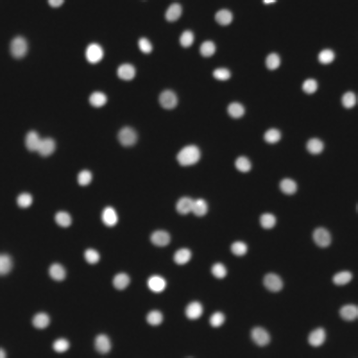
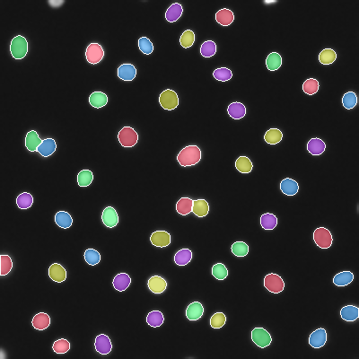
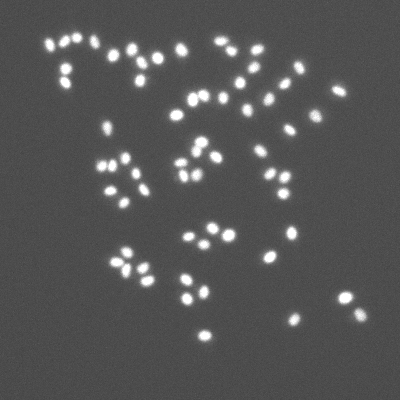
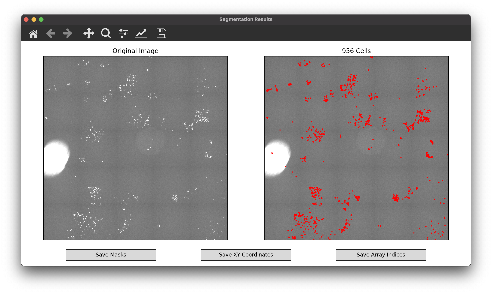

# Cellori (Cell Origin)
A fast and robust intensity-based algorithm for clustered nuclei segmentation in fluorescence microscopy images.

## General
The Cellori algorithm segments nuclei by applying a Gaussian filter to smoothen out background noise, calculating local thresholds to isolate the foreground, and splitting clustered nuclei via local maxima analysis. Masks are obtained using the watershed algorithm.

### Detailed documentation is available at https://cellori.readthedocs.io/.

## Examples

<table border="1" cellpadding="5">

<tr>
<td align="center" valign="center">
Raw Image
</td>

<td align="center" valign="center">
Segmented Image
</td>
</tr>

<tr>
<td align="center" valign="center">

</td>

<td align="center" valign="center">

</td>
</tr>

<tr>
<td align="center" valign="center">

</td>

<td align="center" valign="center">

</td>
</tr>

</table>

## Installation

Install Cellori from [PyPI](https://pypi.org/project/cellori/).

```
pip install cellori
```

## Usage

The built-in GUI is the easiest way to use the Cellori algorithm. Below is a short demo to get you started. For a more comprehensive walk-through, follow our [guided segmentation tutorial](https://cellori.readthedocs.io/). GUI-independent functions for obtaining masks and coordinates are also available, which you can learn more about [here](https://cellori.readthedocs.io/).

### GUI Demo
1. Download the [sample image](docs/demo/wm989.tif) (WM989 cells).
2. Create a Python script with the following lines of code. Make sure that `wm989.tif` is in your current working directory.
```python
from cellori import Cellori

Cellori('wm989.tif').gui()
```
3. After running the script, you will be greeted with the following window. Change the preview region (indicated by the red box) by clicking anywhere on the left panel or using your arrow keys. The center of each nucleus is marked with a red dot, and the total count in the preview region is shown above the right panel.


4. Automatic parameter detection should have already chosen values that work well, but they can be manually adjusted if desired. Click on the "Segment" button to segment the entire image.
5. The segmentation results will be shown in a separate window. Navigate the image using the toolbar at the top of the window. You may use the pan and zoom tools on either the left or right panel. Note that to avoid clutter, cell outlines will only appear once you are sufficiently zoomed in.



6. The buttons at the bottom of the window give you the option to save the segmentation results as CSV or text files for post-processing workflows.
    * Masks: labeled array of the same size as the original image with background pixels as 0 and cells as 1, 2, 3, ..., N.
    * XY Coordinates: array of size (N, 2) with the locations of cell nuclei as coordinates for plotting on standard XY axes.
    * Array Indices: array of size (N, 2) with the locations of cell nuclei as indices of the original image array.
