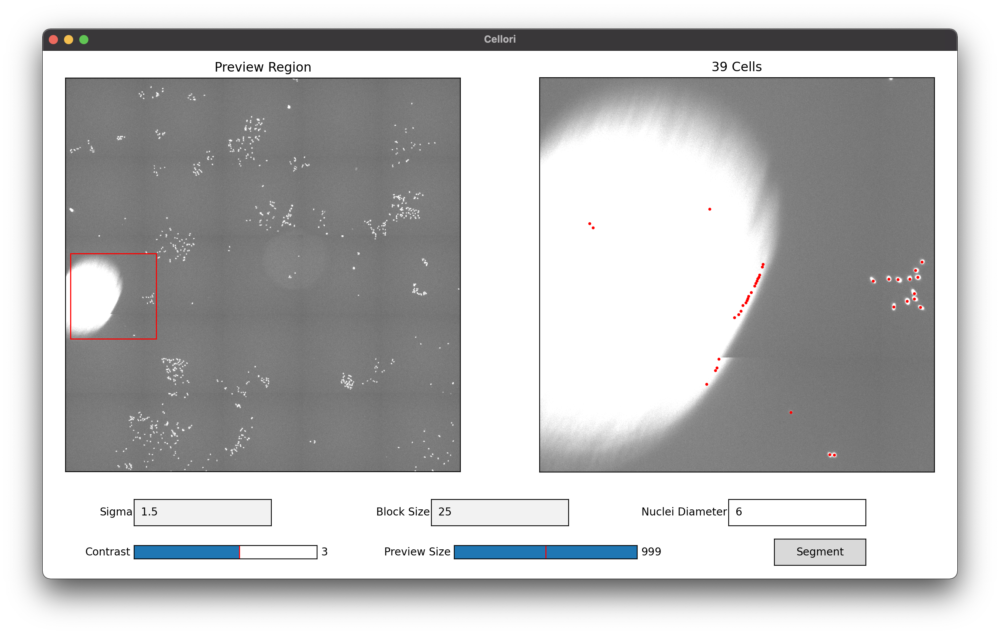
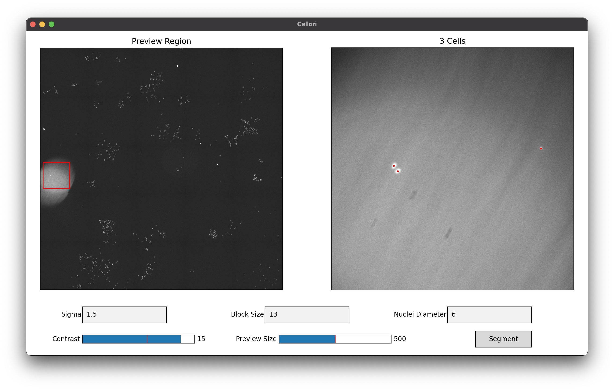

Usage
=====

.. _installation:

Installation
------------

Install Cellori from `PyPI <https://pypi.org/project/cellori/>`_.

.. code-block::

    pip install cellori
    
.. _tutorial:

Guided Segmentation Tutorial
----------------

1. Download the `sample image <https://github.com/SydShafferLab/Cellori/raw/main/docs/demo/wm989.tif>`_ (WM989 cells).
2. Create a Python script with the following lines of code. Make sure that wm989.tif is in your current working directory. If you are using your own image file, also refer to the :doc:`api` documentation for additional parameters that must be specified.

.. code-block:: python

    from cellori import Cellori

    Cellori('wm989.tif').gui()
    
3. After running the script, you will be greeted with the following window. Notice that no cells are currently in view.

.. image:: ../demo/gui1.png
           :width: 1000
           :alt: GUI 1
           
4. Change the preview region (indicated by the red box) by clicking anywhere on the left panel or using your arrow keys. The center of each nucleus is marked with a red dot, and the total count in the preview region is shown above the right panel. Here, we are looking at a colony of cells in the bottom left of the image.

.. image:: ../demo/gui.png
           :width: 1000
           :alt: GUI 2
           
5. Three methods are available for segmentation. Here is a brief description of each method.

   * Combined: Use a combined maxima metric that incorporates both intensity and morphology.
   * Intensity: Use an intensity-only maxima metric.
   * Morphology: Use a morphology-only maxima metric.

5. Automatic parameter detection should have already chosen values that work well, but they can be manually adjusted if desired. Here is a brief description of each parameter.

   * Threshold Locality: Fractional weight on local intensity used in thresholding. The value must be between 0 (global thresholding) and 1 (local thresholding).
   * Gaussian Sigma: Gaussian sigma used for denoising.
   * Nuclei Diameter: Estimated lower bound of nuclei diameters. Any objects smaller than this threshold will not be considered for segmentation.
    
6. We will first explore the efforts of the sigma parameter. A higher sigma results in more blurring, which reduces the issues of background noise and over-segmentation of single nuclei. If we look at segmentation when sigma is 0.5, notice that some single nuclei are being split up into two or even three separate nuclei. However, a sigma that is too high could fail to split clustered nuclei, or worse, miss nuclei altogether, as seen in the segmentation when sigma is 3.5.

.. list-table::
   :widths: 33 33 33
   :header-rows: 1

   * - Sigma = 0.5
     - Sigma = 1.5
     - Sigma = 3.5
   * - 69 Cells
     - 65 Cells
     - 53 Cells
   * - .. image:: ../demo/sigma0.5.png
           :width: 300
           :alt: Sigma = 0.5
     - .. image:: ../demo/default.png
           :width: 300
           :alt: Sigma = 1.5
     - .. image:: ../demo/sigma3.5.png
           :width: 300
           :alt: Sigma = 3.5

7. Next, we will explore the efforts of the block size parameter. A small block size works well when cell density is low, in which you are guaranteed to capture both background and foreground in any small neighborhood, allowing for successful local thresholding. If the cell density is high, a larger block size may be necessary to sample enough background, especially when trying to capture cells with low to intermediate intensity. Here, our cells are neither too sparse nor too dense, so any value of above 7 works well. Notice that when the block size is too small, we may only capture some cells or none at all, as seen in the segmentation for block sizes 3 and 5. In general, use a block size that is larger than your estimated cell diameter.

.. list-table::
   :widths: 33 33 33
   :header-rows: 1

   * - Block Size = 3
     - Block Size = 5
     - Block Size = 13
   * - 0 Cells
     - 61 Cells
     - 65 Cells
   * - .. image:: ../demo/blocksize3.png
           :width: 300
           :alt: Block Size = 3
     - .. image:: ../demo/blocksize5.png
           :width: 300
           :alt: Block Size = 5
     - .. image:: ../demo/default.png
           :width: 300
           :alt: Block Size = 13

8. It is usually safer to use a larger block size, but one that is too large essentially equates to taking a global threshold, which is the exact issue that local thresholding aims to solve. Notice that this image contains a large bright background spot. Increase the preview size using the slider and select it as the preview region.

.. image:: ../demo/gui3.png
           :width: 1000
           :alt: GUI 3
           
9. If we increase the block size to 25, many dots appear near the edge of the bright spot. As we lose locality with increasing block sizes, it becomes more difficult to determine whether this spot is an actual cell or just abnormally bright background.

           
10. Even at a block size of 13, you may have noticed a few dots being marked within the bright spot. Returning to a block size of 13, we can increase the contrast using the slider and zoom in on a smaller region. We will observe three cells within the bright spot that would otherwise be missed using a traditional global thresholding method.

           
11. Finally, we will explore the efforts of the nuclei diameter parameter. This is perhaps the most basic out of the three parameters, as it simply disregards all objects smaller than the specified radii. While basic, selecting the wrong value for this parameter may have devastating effects.

.. list-table::
   :widths: 33 33 33
   :header-rows: 1

   * - Nuclei Diameter = 1
     - Nuclei Diameter = 6
     - Nuclei Diameter = 15
   * - 8116 Cells
     - 65 Cells
     - 12 Cells
   * - .. image:: ../demo/nucleidiameter1.png
           :width: 300
           :alt: Nuclei Diameter = 1
     - .. image:: ../demo/default.png
           :width: 300
           :alt: Nuclei Diameter = 6
     - .. image:: ../demo/nucleidiameter15.png
           :width: 300
           :alt: Nuclei Diameter = 15

12. Click on the "Segment" button to segment the entire image. The segmentation results will be shown in a separate window. Navigate the image using the toolbar at the top of the window. You may use the pan and zoom tools on either the left or right panel.

.. image:: ../demo/segmentation.png
           :width: 1000
           :alt: Segmentation 1

13. Note that to avoid clutter, cell outlines will only appear once you are sufficiently zoomed in.

.. image:: ../demo/segmentation2.png
           :width: 1000
           :alt: Segmentation 2
           
14. The buttons at the bottom of the window give you the option to save the segmentation results as CSV or text files for post-processing workflows.

    * Masks: labeled array of the same size as the original image with background pixels as 0 and cells as 1, 2, 3, ..., N.
    * XY Coordinates: array of size (N, 2) with the locations of cell nuclei as coordinates for plotting on standard XY axes.
    * Array Indices: array of size (N, 2) with the locations of cell nuclei as indices of the original image array.

15. These same segmentation outputs can be achieved without the GUI using built-in command-line functions. For more information about these functions, specifically their parameters and outputs, check out the :doc:`api` documentation.

.. code-block:: python

    from cellori import Cellori

    # Use automatic parameter detection.
    masks,coords = Cellori('wm989.tif').segment()
    
    # Use custom parameters.
    masks,coords = Cellori('wm989.tif').segment(sigma=1.5,block_size=13,nuclei_diameter=6)
