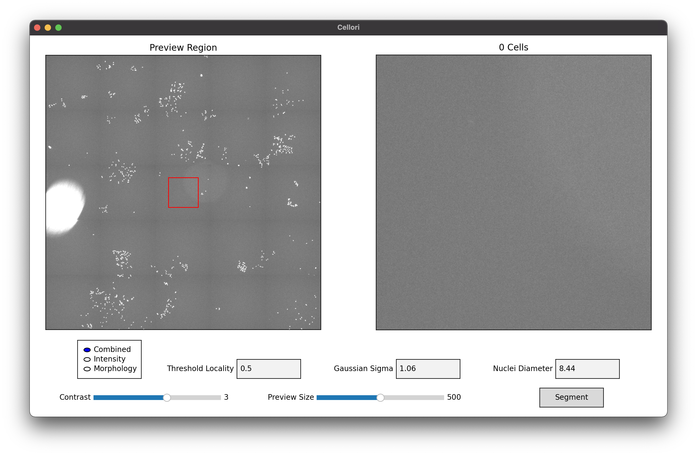
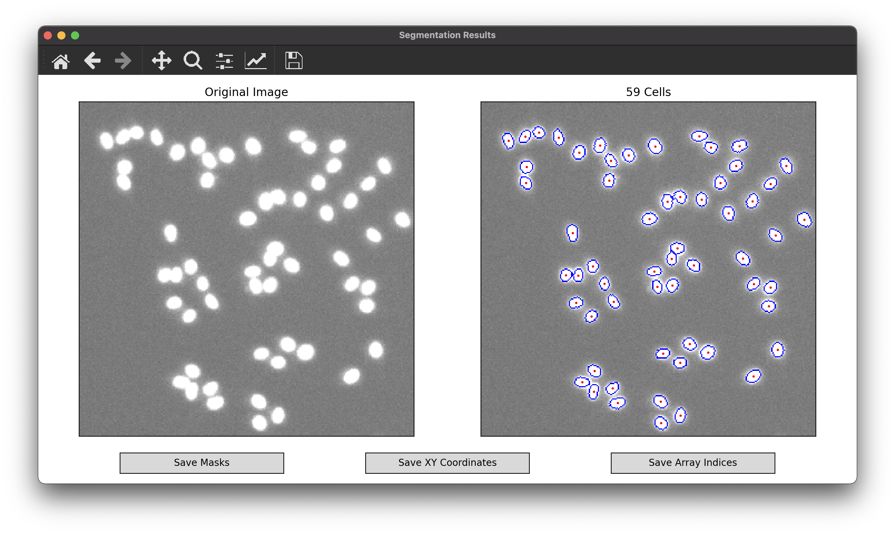

Usage
=====

.. _installation:

Installation
------------

Install Cellori from `PyPI <https://pypi.org/project/cellori/>`_.

.. code-block::

    pip install cellori
    
.. _tutorial:

Guided Segmentation Tutorial
----------------

1. Download the `sample image <https://github.com/zjniu/Cellori/raw/main/docs/demo/wm989.tif>`_ (WM989 cells).
2. Create a Python script with the following lines of code. Make sure that wm989.tif is in your current working directory. If you are using your own image file, also refer to the :doc:`api` documentation for additional parameters that must be specified.

.. code-block:: python

    from cellori import Cellori

    Cellori('wm989.tif').gui()
    
3. After running the script, you will be greeted with the following window. Notice that no cells are currently in view.

           
4. Change the preview region (indicated by the red box) by clicking anywhere on the left panel or using your arrow keys. The center of each nucleus is marked with a red dot, and the total count in the preview region is shown above the right panel. Here, we are looking at a colony of cells in the bottom left of the image.

.. image:: ../demo/gui.png
           :width: 1000
           :alt: GUI 2
           
5. Three methods are available for segmentation. Here is a brief description of each method.

   * Combined: Use a combined maxima metric that incorporates both intensity and morphology.
   * Intensity: Use an intensity-only maxima metric.
   * Morphology: Use a morphology-only maxima metric.

6. Automatic parameter detection should have already chosen values that work well, but they can be manually adjusted if desired. Here is a brief description of each parameter.

   * Threshold Locality: Fractional weight on local intensity used in thresholding. The value must be between 0 (global thresholding) and 1 (local thresholding).
   * Gaussian Sigma: Gaussian sigma used for denoising.
   * Nuclei Diameter: Estimated lower bound of nuclei diameters. Any objects smaller than this threshold will not be considered for segmentation.
    
7. First, we will explore the effects of the threshold locality parameter. The optimal value for this parameter is highly image-dependent. If background intensity is mostly consistent throughout the entire image, then local thresholding may not be necessary, and any value will yield equally good results. Otherwise, setting a higher threshold locality may help to account for inconsistencies in background intensity by considering local thresholding more heavily. In this region of the image, threshold locality appears to have no effect on the segmentation.

.. list-table::
   :widths: 33 33 33
   :header-rows: 1

   * - Threshold Locality = 0
     - Threshold Locality = 0.5
     - Threshold Locality = 1
   * - 65 Cells
     - 65 Cells
     - 65 Cells
   * - .. image:: ../demo/threshold_locality0.png
           :width: 300
           :alt: Threshold Locality = 0
     - .. image:: ../demo/default.png
           :width: 300
           :alt: Threshold Locality = 0.5
     - .. image:: ../demo/threshold_locality1.png
           :width: 300
           :alt: Threshold Locality = 1
           
8. However, notice that this image contains a large bright background spot. Increase the preview size using the slider and select it as the preview region.

           
9. At a threshold locality of 0, which is equivalent to taking a global threshold, noise within the bright spot is being picked up as cells. Increasing the threshold locality to 0.5 helps to solve this issue. Further increasing the threshold locality to 1 completely eliminates all noise. In general, increasing the threshold locality will decrease the number of cells segmented.

.. list-table::
   :widths: 33 33 33
   :header-rows: 1

   * - Threshold Locality = 0
     - Threshold Locality = 0.5
     - Threshold Locality = 1
   * - 27 Cells
     - 19 Cells
     - 17 Cells
   * - .. image:: ../demo/bright_spot_threshold_locality0.png
           :width: 300
           :alt: Threshold Locality = 0
     - .. image:: ../demo/bright_spot_threshold_locality0.5.png
           :width: 300
           :alt: Threshold Locality = 0.5
     - .. image:: ../demo/bright_spot_threshold_locality1.png
           :width: 300
           :alt: Threshold Locality = 1
    
10. Next, we will explore the effects of the Gaussian sigma parameter. A higher sigma results in more blurring, which reduces the issues of noise and over-segmentation of single nuclei. If we look at segmentation when sigma is 0 (essentially no filtering), notice that a single nuclei is incorrectly being split up into two. However, a sigma that is too high could fail to split clustered nuclei, as seen in the segmentation when sigma is 5, or worse, miss nuclei altogether.

.. list-table::
   :widths: 33 33 33
   :header-rows: 1

   * - Sigma = 0
     - Sigma = 1.06
     - Sigma = 5
   * - 66 Cells
     - 65 Cells
     - 62 Cells
   * - .. image:: ../demo/sigma0.png
           :width: 300
           :alt: Sigma = 0
     - .. image:: ../demo/default.png
           :width: 300
           :alt: Sigma = 1.06
     - .. image:: ../demo/sigma5.png
           :width: 300
           :alt: Sigma = 5
           
11. Finally, we will explore the efforts of the nuclei diameter parameter. This is perhaps the most basic out of the three parameters, as it simply disregards all objects smaller than the specified radii. While basic, selecting the wrong value for this parameter may have devastating effects.

.. list-table::
   :widths: 33 33 33
   :header-rows: 1

   * - Nuclei Diameter = 1
     - Nuclei Diameter = 8.44
     - Nuclei Diameter = 15
   * - 228 Cells
     - 65 Cells
     - 24 Cells
   * - .. image:: ../demo/nuclei_diameter1.png
           :width: 300
           :alt: Nuclei Diameter = 1
     - .. image:: ../demo/default.png
           :width: 300
           :alt: Nuclei Diameter = 8.44
     - .. image:: ../demo/nuclei_diameter15.png
           :width: 300
           :alt: Nuclei Diameter = 15

12. Click on the "Segment" button to segment the entire image. The segmentation results will be shown in a separate window. Navigate the image using the toolbar at the top of the window. You may use the pan and zoom tools on either the left or right panel.

.. image:: ../demo/segmentation.png
           :width: 1000
           :alt: Segmentation 1

13. Note that to avoid clutter, cell outlines will only appear once you are sufficiently zoomed in.

           
14. The buttons at the bottom of the window give you the option to save the segmentation results as CSV or text files for post-processing workflows.

    * Masks: labeled array of the same size as the original image with background pixels as 0 and cells as 1, 2, 3, ..., N.
    * XY Coordinates: array of size (N, 2) with the locations of cell nuclei as coordinates for plotting on standard XY axes.
    * Array Indices: array of size (N, 2) with the locations of cell nuclei as indices of the original image array.

15. These same segmentation outputs can be achieved without the GUI using built-in command-line functions. For more information about these functions and other helper functions for post-processing, specifically their parameters and outputs, check out the :doc:`api` documentation.

.. code-block:: python

    from cellori import Cellori, utils

    # Segment using automatic parameter detection.
    masks, coords, image = Cellori('wm989.tif').segment()
    
    # Segment using custom parameters.
    masks, coords, image = Cellori('wm989.tif').segment(segmentation_mode='combined', threshold_locality=0.5, sigma=1.06, nuclei_diameter=8.44)
    
    # Create segmentation overlay.
    overlay = utils.overlay_segmentation(image, masks)
    
